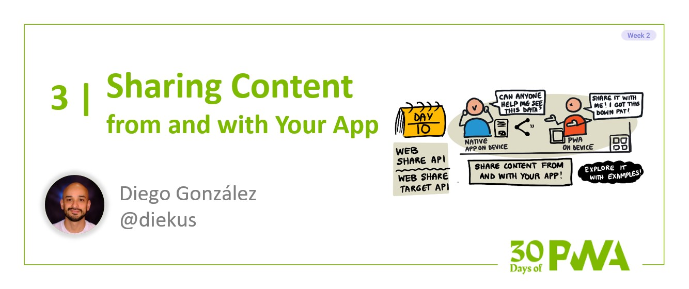
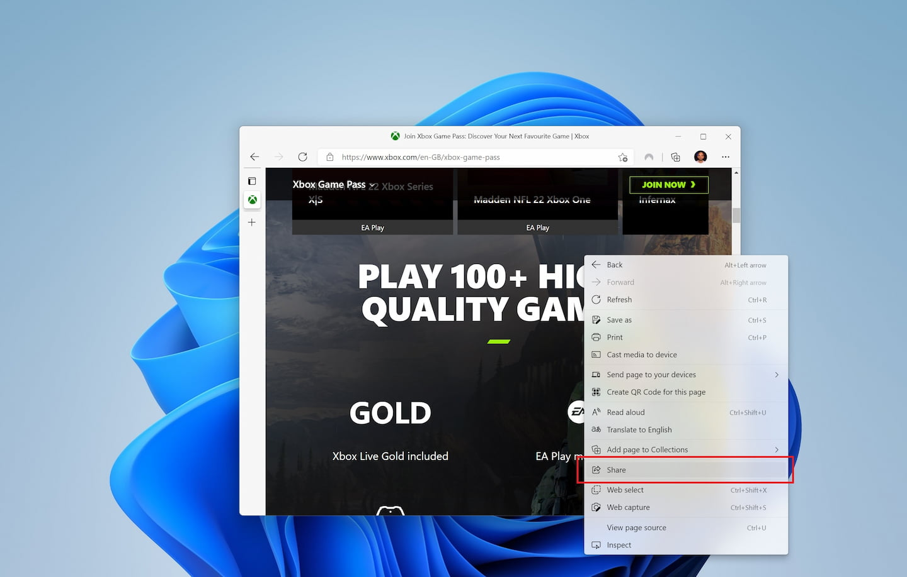
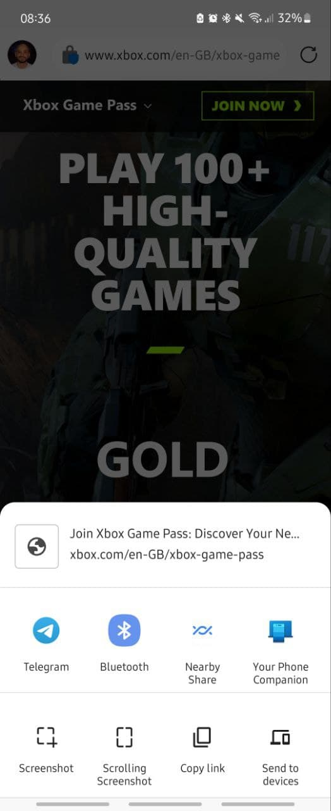
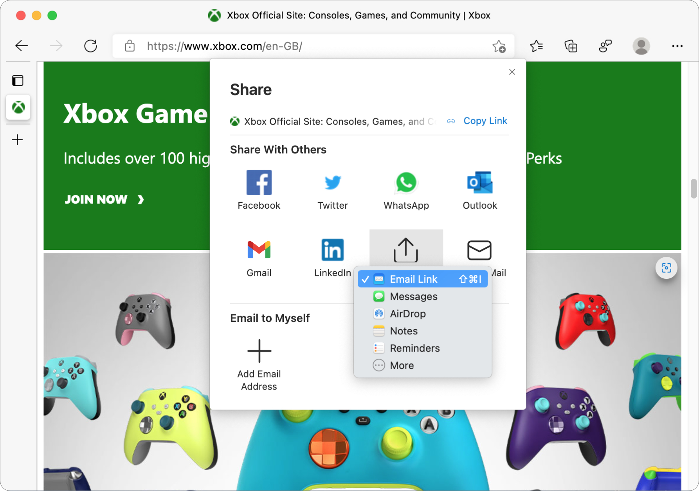
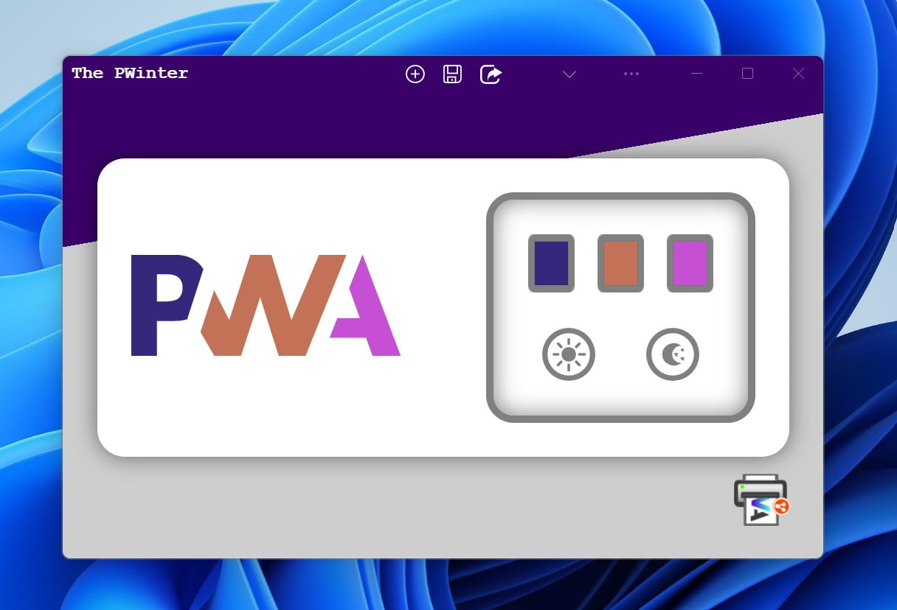
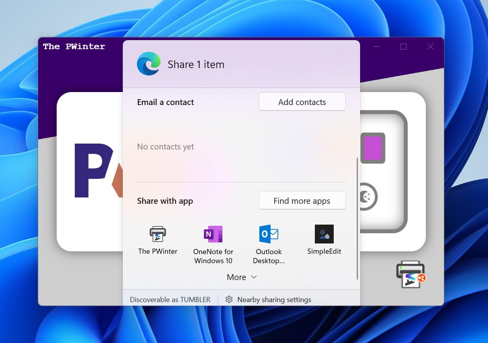
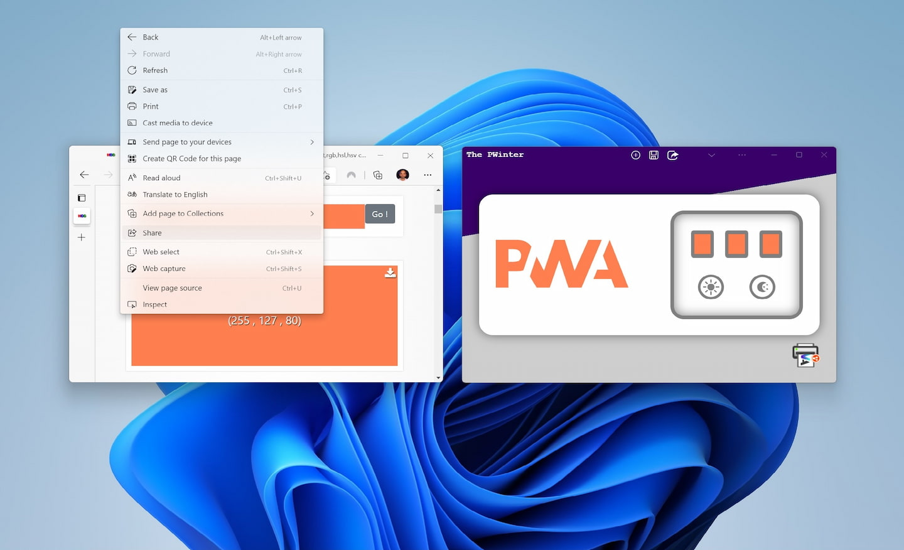

# 2.3: Sharing content from and with your app

**Author: Diego González [@diekus](https://twitter.com/diekus)**



### WHAT WE'LL COVER TODAY

| Section | Description |
| ------- | ----------- |
| **Definition** | What does it mean to share content between apps? What kind of content are we talking about? |
| **Sharing *from* your application** | Learn how to share content directly from your PWA. |
| **Sharing *to* your application** |Prepare your PWA to receive shared content. |
| **Related** | Look for other OS integrations throughout [Week 2: Advanced Capabilities](../advanced-capabilities/). |

---

# Definition

Hola! For today’s post on the [30 Days of PWA](https://aka.ms/learn-pwa/30Days-blog) series, we will cover sharing! You know, “sharing is caring”. This is a saying that we probably hear often…and with good reason. We are social beings and communicating things with those we care about is natural. Whether it be important news or a funny meme, the ability to distribute information plays a significant role in our lives and impacts how we discover, interact and even make decisions. It is not surprising that with the vast amount of information on the web, the ability to share content becomes increasingly relevant, and will often form the basis for a good user experience. For this reason, modern web browsers make it easy to share content, generally offering options in their context menus or settings to facilitate this. The next screenshot shows the context menu of Microsoft Edge with a Share option highlighted, as an example.



Sharing information through a web browser usually involves a sharing dialog box that is native to the operating system being used. The dialog provides options of whom and where to share with, which might vary depending on the type of content. In the example mentioned above, where we are sharing a web page (or a URL), then any application that handles text or links can act as a target that can receive the shared content. It may be that you wish to share this page with a friend via instant messaging, or email the link to a co-worker; these are just two of many different options that we use on a daily basis. This is how sharing looks on Android:



And this is how it looks on macOS.



As shown in the images above, the action of sharing invokes the operating system's share dialog. This creates a seamless integrated experience independent of where you are sharing from, allowing the user to send information between applications. Now, here is where it gets really interesting.
Now that I have laid out the concept of sharing between apps, let's bring PWAs into the mix. We can use the `Web Share API` and `Web Share Target API` to invoke this sharing UX to share specific content, allowing your web app to behave like any other installed app.

# Our demo PWA
To demonstrate how the `Web Share API` works, I will use the PWinter PWA, available [here](https://aka.ms/learn-PWA/30Days-2.3/github.com/diekus/pwinter). This PWA allows a user to create custom themed PWA logos. These logos can then be saved as SVG files to be shared.



# Sharing from your application
Let’s start by looking at how to share from your web application. We want to be able to share data from the PWA to another app that can handle the type of data being shared. As is the case for many things web, “there’s an API for that”. For this specific scenario, the Web Share API comes to the rescue, and we can use the `navigator.share()` method, which takes as a parameter the data we want to share. This data can be composed of a url, text, title, or an array of files if the system supports it. This will return a promise that resolves if the data is shared. As is the case with advanced powerful APIs, you need to be running off a secure connection to be able to use the `Web Share API`.

## Sharing a link
The PWinter app can share its URL, making it easy to distribute the address to the app with another user. In order to do so, it displays an icon on the lower right corner that when clicked, invokes the `Web Share API`. The following code shares a title, text and url, and brings up the browser/OS share UI when executed.

```javascript
// Shares a link with the Web Share API
async function sharePWinter() {
    const shareData = {
        title: 'PWinter',
        text: 'Design your own PWA Logo.',
        url: 'https://diek.us/pwinter',
    };
    await navigator.share(shareData)
    .then(() => console.log('PWinter shared!'))
    .catch((error) => console.error(error));    
};

```

## Sharing files
You can share more than just text! The `Web Share API` also allows you to share files. This capability works with images, PDFs, audio, text documents and video. The full list of supported file types is [here](https://aka.ms/learn-PWA/30Days-2.3/developer.mozilla.org/en-US/docs/Web/API/Navigator/share#shareable_file_types), but independently you should always make sure to test if the sharing action would succeed with the type of file you want to share. 

In order to do so, you can use the `navigator.canShare()` method, which returns `true` if the sharing would succeed. The method can return false if the data can’t be validated. This might happen due to badly formatted URLs, missing data parameters, security reasons or even because the implementation does not support a specific file type.
Once you know that your sharing would succeed, you can specify the files to share in an array that you pass as an option to the share method. The following code from the demo PWA PWinter shares a logo created by the user in SVG format.  

```javascript
if (navigator.canShare && navigator.canShare({ files: filesArray })) {
        await navigator.share({
            files: filesArray,
            title: 'My PWA Logo',
            text: 'Custom PWA logo from The PWinter.'
        })
        .then(() => console.log('Share was successful.'))
        .catch((error) => console.log('Sharing failed', error));
        }
        else {
            console.log(`System doesn't support sharing.`);
    }

```



# Sharing to your application
Last but definitely not least, you can share information to your PWA. The `Web Share Target API` allows us to do this. This is very handy since you can register the application as to be on the receiving end of a share, hence allowing it to integrate with the OS’s share UX. In the previous image, you can spot that the SVG file created by the user can be shared with a set of apps listed in the bottom part of the OS’s share UX; notably, SimpleEdit and The PWinter, two of the apps listed above, are themselves PWAs that can handle image files.

The way to register a PWA as a share target is through the manifest file by adding a “share_target” entry to it. In order to accept simple data, such as a link or text, the entry would look like the following:

```json
"share_target": {
      "action": "index.html?shared-color",
      "method": "GET",
      "enctype": "application/x-www-form-urlencoded",
      "params": {
        "title": "title",
        "text": "text",
        "url": "url"
      }
    }
```
Something important to note is that the action key defines which part of the PWA will handle the incoming data. For the demo PWA, this addition to the manifest file indicates that a link will be received and processed in the `index.html?shared-color` url. This file has code in place that knows that when this url is called, it will try to parse the incoming link to detect any hex colour code; this will set the letters of the PWA logo to that specific colour.



The incoming information can change the target app, and also accept files. For this, you must set the method key value to `POST`, the enctype field to `multipart/form-data`, and a files array for any files that might be attached. When the user shares to a PWA, the browser will open up the app on the action url and process the data accordingly.

# Summary
I have explained the two parts of sharing with PWAs. Sharing from the app is achieved by the `Web Share API`. You can share a variety of information with it. You can share to the app by registering it as a share target, with the `Web Share Target API`. This is done through an entry in the manifest file. These 2 advanced capabilities make your PWA integrate seamlessly with your platform, and help create a smooth unified experience.
The `Web Share API` is currently supported on Windows, macOS, Linux, Android and iOS. There are some engines that do not have support, so be ready to check and accommodate your app accordingly. `Web Share Target API` relies on the manifest and installation of a PWA which means it is supported on Chromium-based browsers.

Now you are ready to share and continue with tomorrow's post in the [series](https://aka.ms/learn-pwa/30Days-blog) where you'll learn about display modes! 


# Resources
* [Share content with other apps](https://aka.ms/learn-PWA/30Days-2.3/developer.mozilla.org/en-US/docs/Web/API/Navigator/share) at Microsoft Docs.
* [Web Share API](https://aka.ms/learn-PWA/30Days-2.3/developer.mozilla.org/en-US/docs/Web/API/Web_Share_API) at MDN Web Docs 
